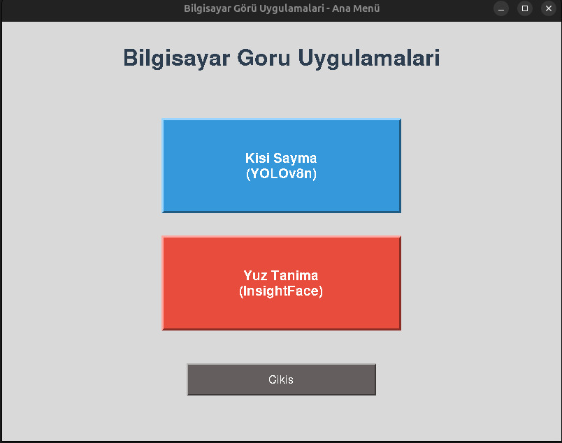
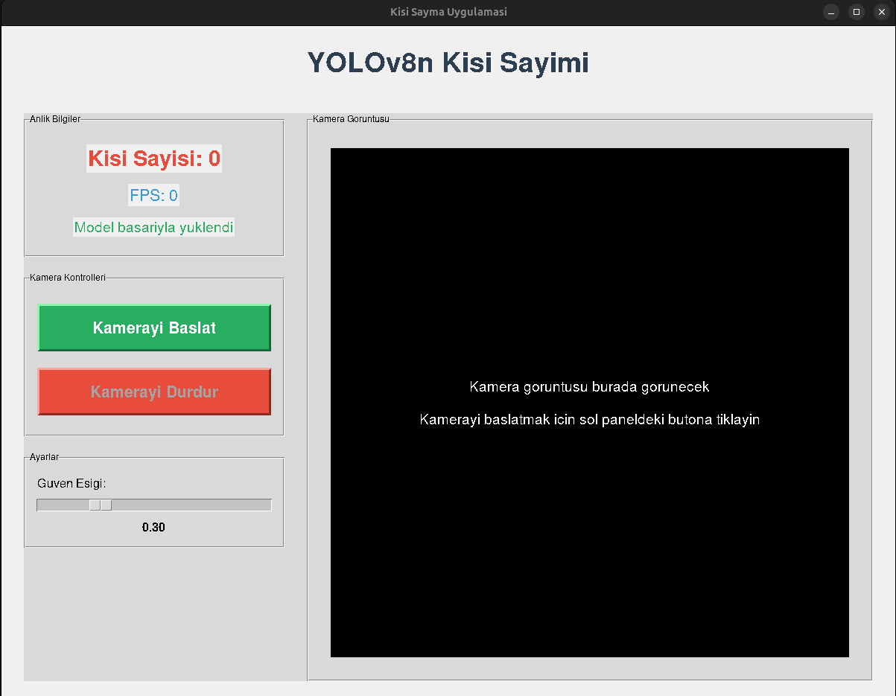
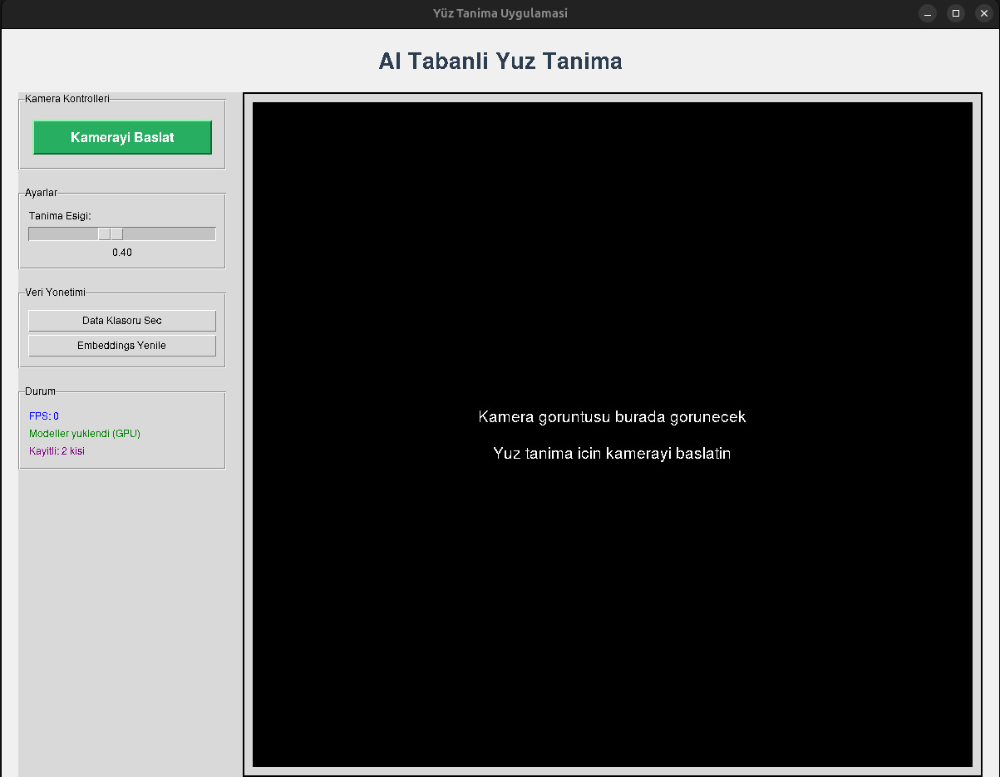

# Gömülü Sistemler Projesi

## Proje Hakkında

Bu proje, gömülü sistemler dersi kapsamında bilgisayarla görme tabanlı iki temel uygulama sunar:
- **Kişi Sayma (YOLOv8n):** Gerçek zamanlı kamera görüntüsünde insanları tespit edip sayar.
- **Yüz Tanıma (InsightFace):** Kamera görüntüsünde yüzleri tespit eder ve önceden kayıtlı yüzlerle eşleştirerek tanıma işlemi yapar.

Her iki uygulama da GPU desteğiyle çalışacak şekilde optimize edilmiştir ve kullanıcı dostu bir arayüz sunar.

## Kullanılan Teknolojiler ve Kütüphaneler

- **Python 3.x:** Projenin ana programlama dili.
- **Tkinter:** Grafiksel kullanıcı arayüzü (GUI) için.
- **OpenCV:** Görüntü işleme ve kamera erişimi.
- **Ultralytics YOLOv8:** Gerçek zamanlı nesne tespiti (özellikle insan tespiti için).
- **InsightFace:** Yüz tespiti ve yüz vektörü çıkarımı.
- **scikit-learn:** Yüz vektörleri arasında benzerlik ölçümü (cosine similarity).
- **Pillow:** Görüntülerin işlenmesi ve Tkinter ile entegrasyonu.
- **NumPy:** Sayısal işlemler ve vektör hesaplamaları.
- **CUDA (isteğe bağlı):** GPU hızlandırma için NVIDIA CUDA desteği.

## Sistem Gereksinimleri

- Python 3.8 veya üzeri
- NVIDIA GPU (isteğe bağlı, önerilir)
- CUDA ve cuDNN (GPU desteği için)
- Webcam

## Kurulum

1. Depoyu klonlayın:
   ```sh
   git clone <repo-url>
   cd gomulu_sistemler_proje
   ```

2. Gerekli bağımlılıkları yükleyin:
   ```sh
   pip install -r requirements.txt
   ```

> **Not:** GPU desteği için CUDA ve uygun NVIDIA sürücüleri kurulu olmalıdır.

## Kullanım

Ana uygulamayı başlatmak için:
```sh
python main_app.py
```

Açılan ana menüden istediğiniz uygulamayı seçebilirsiniz:
- **Kişi Sayma:** YOLOv8 ile gerçek zamanlı kişi tespiti ve sayımı.
- **Yüz Tanıma:** InsightFace ile yüz tespiti ve tanıma.

### Yüz Tanıma için Veri Hazırlama

`data/` klasörü altında her kişi için bir klasör oluşturun ve o kişiye ait yüz fotoğraflarını bu klasöre ekleyin. Örnek:
```
data/
  person1/
    1.jpg
    2.jpg
  person2/
    1.png
    2.png
```
Daha sonra uygulama içinden "Embeddings Yenile" butonunu kullanarak yüz vektörlerini güncelleyebilirsiniz.

### Uygulama Akışı

1. **Ana Menü:** Kullanıcı, kişi sayma veya yüz tanıma uygulamasını seçer.
2. **Kişi Sayma:** Kamera görüntüsünde gerçek zamanlı olarak insanları tespit eder ve sayar.
3. **Yüz Tanıma:** Kamera görüntüsünde yüzleri tespit eder, veri klasöründeki kayıtlı yüzlerle karşılaştırır ve tanıma işlemi yapar.
4. **Ayarlar:** Her iki uygulamada da eşik değerleri ve diğer parametreler kullanıcı tarafından ayarlanabilir.
5. **Veri Yönetimi:** Yüz tanıma uygulamasında veri klasörü seçilebilir ve embeddings güncellenebilir.

## Ekran Görüntüleri

Aşağıda, `img` klasöründe bulunan bazı örnek ekran görüntüleri yer almaktadır:

<p align="center">
  
  <br>
  <b>Ana Menü</b>
</p>

<p align="center">
  
  <br>
  <b>Kişi Sayma Uygulaması</b>
</p>

<p align="center">
  
  <br>
  <b>Yüz Tanıma Uygulaması</b>
</p>

> Görsellerin doğru görüntülenmesi için `img` klasörünün proje dizininde bulunması gerekmektedir.

## Dosya Yapısı

```
gomulu_sistemler_proje/
├── main_app.py              # Ana menü ve uygulama başlatıcı
├── person_counter.py        # Kişi sayma uygulaması (YOLOv8)
├── face_recognition_app.py  # Yüz tanıma uygulaması (InsightFace)
├── requirements.txt         # Gerekli Python paketleri
├── embeddings/              # Yüz vektörlerinin kaydedildiği klasör
├── data/                    # Yüz tanıma için kişi fotoğrafları
├── img/                     # Ekran görüntüleri ve görseller
│   ├── main_menu.png
│   ├── person_counter.png
│   └── face_recognition.png
└── README.md
```

## Katkıda Bulunma

Katkıda bulunmak için lütfen bir pull request gönderin veya issue açın.

## Lisans

Bu proje MIT lisansı ile lisanslanmıştır.